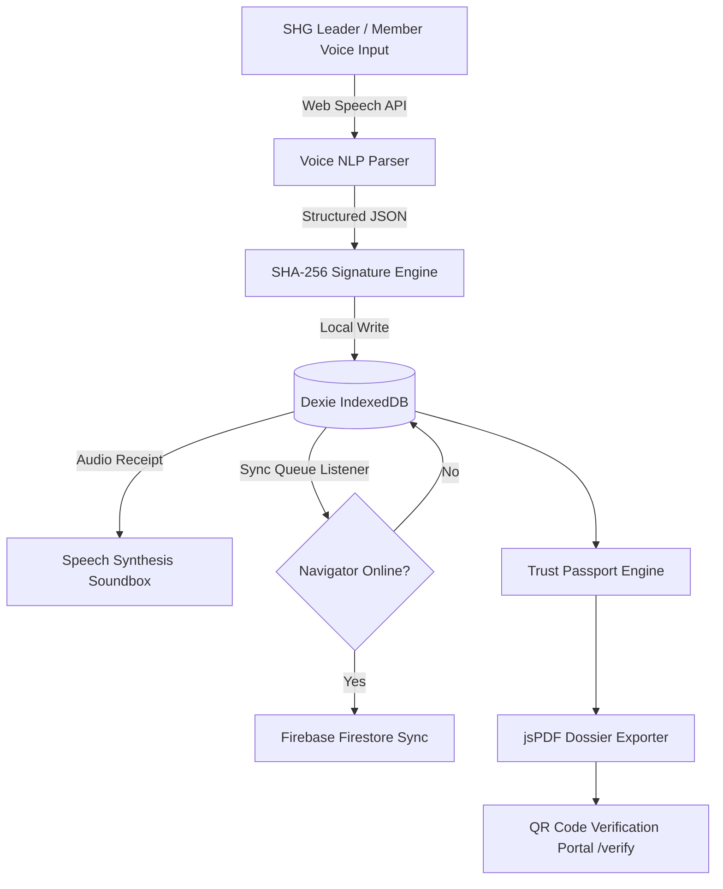

# SakhiSetu (सखीसेतु)

> **AI-Powered Offline Financial Operating System for Women's Self-Help Groups (SHGs) in Rural India**

---

## 📌 Problem Statement

Over 120 million women in rural India participate in **Self-Help Groups (SHGs)** under NRLM (National Rural Livelihoods Mission). However, financial inclusion remains constrained by:

* **Manual Paper Bookkeeping:** High error rate and loss of records during weekly meetings.
* **Lack of Formal Credit History:** Banks refuse loans to SHGs due to unverified offline ledgers.
* **Literacy & Language Barriers:** Complex financial apps fail in low-literacy rural settings.
* **Intermittent Connectivity:** 2G/3G networks in rural areas break traditional cloud-only banking apps.

---

## 💡 The SakhiSetu Solution

**SakhiSetu** is an **offline-first Progressive Web Application (PWA)** that digitizes SHG bookkeeping using **Voice AI in local languages** (Hindi/English). It records meeting transactions, calculates an explainable **Trust Score**, generates **cryptographically verifiable Bank Dossiers (SHA-256)**, and auto-syncs when internet connectivity is restored.

---

## ✨ Key Features

* 🎙️ **Voice-First AI Bookkeeping:** Record weekly savings & loan repayments in Hindi/English via Web Speech API with real-time NLP parsing.
* 🔊 **Audio Soundbox Receipts:** Immediate verbal confirmation via Speech Synthesis to establish trust among all members present.
* 📶 **Offline-First PWA (IndexedDB + Dexie.js):** Zero dependency on active internet. Transactions persist locally and sync auto-queue to Firebase upon reconnection.
* 🛡️ **SHA-256 Cryptographic Verification:** Every transaction and exported report is signed with an immutable Web Crypto SHA-256 hash.
* 📈 **Explainable Trust Passport (0–1000 Score):** Transparent credit identity computed from repayment discipline (40%), savings regularity (30%), attendance (20%), and record completeness (10%).
* 📄 **4 Unique PDF Generators:** Client-side downloadable PDFs for Official Bank Dossiers, Loan Utilisation Reports, Quarterly Audit Packs, and Governance Sheets.
* 📱 **Scannable QR Verification Portal:** Bank officers scan dossier QR codes to verify untampered ledger signatures without logging in.

---

## 🛠️ Tech Stack

* **Frontend Framework:** React 18, TypeScript, Vite, TanStack Router
* **Styling & UI:** Vanilla Tailwind CSS, Framer Motion, Lucide Icons, Recharts
* **Database & Persistence:** Dexie.js (IndexedDB), Firebase Firestore
* **Offline PWA:** Service Worker (sw.js), Web App Manifest
* **Voice & Speech:** Web Speech Recognition API & Web Speech Synthesis API
* **Security & PDF:** Web Crypto API (SHA-256), jsPDF, qrcode.react

---

## 🏗️ System Architecture



---

## 📊 Application Flow

1. **Meeting Mode:** SHG Leader taps record and speaks: *"Sunita 500 bachat"*.
2. **AI Transaction Parsing:** Voice is transcribed and parsed into structured JSON (`Sunita Pawar | Savings | ₹500`).
3. **Soundbox Audible Confirmation:** Speaker announces: *"Sunita Pawar ki ₹500 bachat safalta se jama ho gayi."*
4. **Offline Local Storage:** Transaction signed with SHA-256 and saved in IndexedDB.
5. **Auto Cloud Sync:** Automatically pushes queued records to Firebase once 4G/Wi-Fi reconnects.
6. **Bank Dossier & QR Verification:** Export 4-page Bank Dossier PDF with scannable QR verification for Lead Bank loan sanctioning.

---

## 🚀 Installation & Local Setup

```bash
# 1. Clone the repository
git clone https://github.com/your-username/sakhisetu-empowering-shgs.git
cd sakhisetu-empowering-shgs

# 2. Install dependencies
npm install

# 3. Start local dev server
npm run dev
```

The application will be available at `http://localhost:5173`.

---

## 🔑 Environment Variables

Create a `.env` file in the project root:

```env
VITE_FIREBASE_API_KEY=your_firebase_api_key
VITE_FIREBASE_AUTH_DOMAIN=your_project.firebaseapp.com
VITE_FIREBASE_PROJECT_ID=your_project_id
VITE_FIREBASE_STORAGE_BUCKET=your_project.appspot.com
VITE_FIREBASE_MESSAGING_SENDER_ID=your_messaging_sender_id
VITE_FIREBASE_APP_ID=your_app_id
```

*(Note: If environment variables are omitted, SakhiSetu operates in full offline/demo fallback mode seamlessly).*

---

## 📦 Build & Deployment

```bash
# Typecheck & production build
npm run build

# Preview build locally
npm run preview
```

### Vercel Deployment

SakhiSetu is pre-configured with `vercel.json` for seamless client-side SPA routing and Service Worker header configuration.

---

## 📁 Repository Structure

```
sakhisetu-empowering-shgs/
├── public/
│   ├── manifest.json       # PWA Web App Manifest
│   ├── sw.js               # Service Worker Offline Caching
│   └── favicon.ico
├── src/
│   ├── components/         # Reusable UI cards, QR preview & navigation shell
│   ├── data/               # Seeding demo data for Kondhapuri SHG (15 members)
│   ├── firebase/           # Firestore & Auth service integrations
│   ├── hooks/              # Offline sync & state management hooks
│   ├── lib/                # SHA-256 crypto, Dexie IndexedDB & jsPDF generators
│   ├── routes/             # TanStack Router pages (Dashboard, Meeting, Members, etc.)
│   ├── services/           # Voice AI Recognition, NLP parser & Soundbox
│   └── types/              # TypeScript definitions for SHG entities
├── vercel.json             # Vercel SPA rewrite rules
├── vite.config.ts          # Vite build configuration
└── package.json
```

---

## 🔮 Future Roadmap

* **OCEN 2.0 Integration:** Direct API pipeline for automated micro-loan disbursement from partner banks.
* **Multilingual AI Models:** Local dialect voice parser support for Marathi, Gujarati, Kannada, and Tamil.
* **Biometric Hardware Soundbox:** Standalone IoT soundbox integration for offline village meetings.

---

<p center>Built for Rural Financial Inclusion </p>
